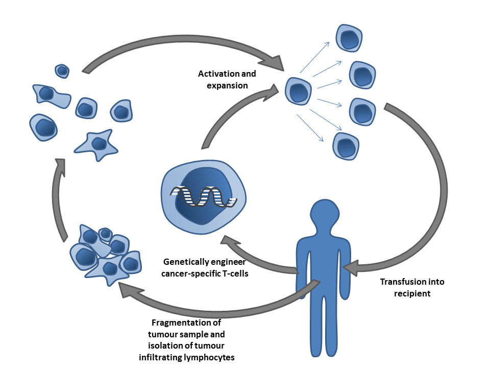

```{r setup, include=FALSE}
knitr::opts_chunk$set(echo = TRUE, eval = TRUE, comment = NA)
```

This is a guest post from Leon Eyrich Jessen,  a reseach data scientist in the [Immunoinformatics and Machine Learning Group](http://www.bioinformatics.dtu.dk/english/Research_new/Health-informatics/Immunoinformatics-and-machine-learning) and the [T-cell recognition and cancer group](http://www.vet.dtu.dk/english/research/immunology-and-vaccinology/research/sine-reker-hadrup) at the Technical University of Denmark.

***

## Introduction

<div style="float:right; font-size: 0.75em; margin-left:10px; text-align: center;">
<a href="https://commons.wikimedia.org/wiki/File:Adoptive_T-cell_therapy.png">
{width=350 style="display:block; margin-bottom:10px;"}
</a>
<a href="https://commons.wikimedia.org/wiki/User:Simoncaulton" style="">Simon Caulton</a>, <a href="https://commons.wikimedia.org/wiki/File:Adoptive_T-cell_therapy.png">Adoptive T-cell therapy</a>, <a href="https://creativecommons.org/licenses/by-sa/3.0/legalcode">CC BY-SA 3.0</a>

</div>


Cancer immunotherapy (Immuno-oncology or Immunooncology) is the use of the immune system to treat cancer. This post describes some applications of deep learning to cancer immunotherapy research, specifically, for the classification of peptides. We believe this is a promising approach because deep learning has already proven invaluble and highly succesful in [modelling the interaction between the sick cell and the peptide](http://www.cbs.dtu.dk/services/NetMHCpan/) (96.5% of natural ligands are identified at a very high specificity 98.5%).

Some brief background before diving in. Special immune cells (T-cells) patrol the body, looking for cells displaying unexpected peptides. If a displayed peptide is unexpected, the T-cells will terminate the cell. The T-cells have been educated to recognise peptides and ignore peptides which originate from our own body. Adoptive T-cell therapy is a form of cancer immunotherapy that aims to take a sample of a tumour, isolate its T-cells, then grow them in great numbers and reintroduce them into the body. 

The aim of this use case is to create a simple deep feed forward artificial neural network to classify whether a given peptide is a 'strong binder' `SB`, 'weak binder' `WB` or 'non-binder' `NB`. This classification determines whether the peptide is presented to the immune system or not.

Next, we'll dive into building the neural network. If you want to a more detailed explanation of cancer immunotherapy and how it interacts with the human immune system before going further, see the [primer on cancer immunotherapy](#primer-on-cancer-immunotherapy) at the end of the post.

## Peptide Classification Model

### Prerequisites

This example utilizes the [keras](https://tensorflow.rstudio.com/keras) package, several [tidyverse](https://tidyverse.org) packages, as well as the [ggseqlogo](https://github.com/omarwagih/ggseqlogo) and [PepTools](https://github.com/leonjessen/PepTools) packages. You can install these packages as follows:

```{r, eval=FALSE}
# devtools for installing packages
install.packages("devtools")
library(devtools)

# Keras + TensorFlow and it's dependencies
install_github("rstudio/keras")
library(keras)
install_keras()

# Tidyverse (readr, ggplot2, etc.)
install.packages("tidyverse")

# Packages for sequence logos and peptides
devtools::install_github("omarwagih/ggseqlogo")
devtools::install_github("leonjessen/PepTools")
```

We can now load all of the packages we need for this example:

```{r, message=FALSE}
library(keras)
library(tidyverse)
library(ggseqlogo)
library(PepTools)
```

### Peptide Data

A peptide is a small fragment of a protein of length ~5-15 amino acids. In this use case, we will be working with `9-mers`, i.e. peptides made of 9 amino acids. Peptides play a crucial role in the monitoring of sick cells in our body by the human immune system.

The input data for this use case was created by generating 1,000,000 random 9-mer peptide by sampling the 20 amino acids with replacement and then submitting the peptides to the current state-of-the-art method for binding prediction [`netMHCpan`](http://www.cbs.dtu.dk/services/NetMHCpan/). Different variants of MHCI exists, so for this case we chose `HLA-A*02:01`. This method assigns 'strong binder' `SB`, 'weak binder' `WB` or 'non-binder' `NB` to each peptide. Since `n(SB) < n(WB) << n(NB)`, the data was subsequently balanced by down sampling, such that `n(SB) = n(WB) = n(NB) = 7,920`. Thus, a data set with a total of `23,760` data points was created. 

A sample across the entire dataset of size 10% was assigned as `test` data and the remainder as `train` data. It should be noted that since the data set originates from a model, the outcome of this use case will be a model of a model. However, netMHCpan is very accurate (96.5% of natural ligands are identified at a very high specificity 98.5%). The final input data is available [here](https://raw.githubusercontent.com/leonjessen/keras_tensorflow_demo/master/data/ran_peps_netMHCpan40_predicted_A0201_reduced_cleaned_balanced.tsv). In the following each peptide will be encoded using the [BLOSUM62 matrix](https://www.ncbi.nlm.nih.gov/Class/FieldGuide/BLOSUM62.txt) using the `pep_encode()` function from the [PepTools](https://github.com/leonjessen/PepTools/) package. This way each peptide is converted to an 'image' matrix with 9 rows and 20 columns.

Reference: [Inside Life Science, Genetics by the Numbers](https://publications.nigms.nih.gov/insidelifescience/genetics-numbers.html)
</details>

Let's load the data:

```{r load_data, message=FALSE}
pep_file = get_file("ran_peps_netMHCpan40_predicted_A0201_reduced_cleaned_balanced.tsv", 
                    origin = "https://git.io/vb3Xa") 
pep_dat  = read_tsv(file = pep_file)
``` 

The example peptide data looks like this:

```{r view_pep_dat}
pep_dat
```

Where `peptide` is a set of `9-mer` peptides, `label_chr` defines whether the peptide was predicted by `netMHCpan` to be a strong-binder `SB`, weak-binder `WB` or `NB` non-binder to `HLA-A*02:01`. `label_num` is equivalent to `label_chr`, only the predicted binding is coded into three numeric classes. Finally `data_type` defines whether the particular data point is part of the training set or the ~10% data left out and used for final evaluation. The data has been balanced, as shown in this summary:

```{r summarise_pep_dat}
pep_dat %>% group_by(label_chr, data_type) %>% summarise(n = n())
```

We can use the `ggseqlogo` package to visualise the sequence motif for the strong binders. This allows us to see which positions and amino acids are important for the binding:

```{r seq_logo}
pep_dat %>% filter(label_chr=='SB') %>% pull(peptide) %>% ggseqlogo()
```


### Data Preparation

We are creating a model `f`, where `x` is the peptide and `y` is one of three classes `SB`, `WB` and `NB`, such that `f(x) = y`. Each peptide is encoded using the [BLOSUM62 matrix](https://www.ncbi.nlm.nih.gov/Class/FieldGuide/BLOSUM62.txt), such that each peptide becomes an 'image' matrix with 9 rows and 20 columns.

To feed data into a nueral network we need to encode it as a multi-dimensional array (or "tensor"). in this case we have a 3-D array of ‘total number of peptides’ x ‘length of each peptide (9)’ x ‘number of unique residues (20)’.

Here's how transform the data frame into 3-D arrays of training and test data:

```{r set_train_and_test}
x_train = pep_dat %>% filter(data_type == 'train') %>% pull(peptide)   %>% pep_encode
y_train = pep_dat %>% filter(data_type == 'train') %>% pull(label_num) %>% array
x_test  = pep_dat %>% filter(data_type == 'test')  %>% pull(peptide)   %>% pep_encode
y_test  = pep_dat %>% filter(data_type == 'test')  %>% pull(label_num) %>% array
```

To prepare the data for training we convert the 3-d arrays into matrices by reshaping width and height into a single dimension (9x20 peptide ‘images’ are flattened into vectors of lengths 180):

```{r flatten_tensor}
x_train = array_reshape(x_train, c(nrow(x_train), 9 * 20))
x_test  = array_reshape(x_test,  c(nrow(x_test), 9 * 20))
```

The y data is an integer vector with values ranging from 0 to 2. To prepare this data for training we encode the vectors into binary class matrices using the Keras `to_categorical` function:

```{r set_bin_matrices}
y_train = to_categorical(y_train, num_classes = 3)
y_test  = to_categorical(y_test,  num_classes = 3)
```

### Defining the Model

The core data structure of Keras is a model, a way to organize layers. The simplest type of model is the Sequential model, a linear stack of layers. We begin by creating a sequential model and then adding layers using the pipe (`%>%`) operator:

```{r define_model}
model <- keras_model_sequential() %>% 
  layer_dense(units  = 180, activation = 'relu', input_shape = 180) %>% 
  layer_dropout(rate = 0.4) %>% 
  layer_dense(units  = 90, activation  = 'relu') %>%
  layer_dropout(rate = 0.3) %>%
  layer_dense(units  = 3, activation   = 'softmax')
```

A dense layer is a standard neural network layer with each input node is connected to an output node. A dropout layer sets a random proportiion of activations from the previous layer to 0, which helps to prevent overfitting.

The `input_shape` argument to the first layer specifies the shape of the input data (a length 180 numeric vector representing a peptide 'image'). The final layer outputs a length 3 numeric vector (probabilities for each class `SB`, `WB` and `NB`) using a softmax activation function.

We can use the `summary()` function to print the details of the model:

```{r summarise_model}
summary(model)
```

Next, compile the model with appropriate loss function, optimizer, and metrics:

```{r compile_model}
model %>% compile(
  loss      = 'categorical_crossentropy',
  optimizer = optimizer_rmsprop(),
  metrics   = c('accuracy')
)
```

### Training and Evaluation

We use the fit() function to train the model for 150 epochs using batches of 50 peptide ‘images’:

```{r train_and_eval, results='hide'}
history = model %>% fit(
  x_train, y_train, 
  epochs = 150, batch_size = 50, validation_split = 0.2)
```

We can visualise the training progress by plotting the `history` object returned from `fit()`:

```{r visualise_training}
plot(history)
```


We can now evaluate the model’s performance on the original ~10% left out test data:

```{r eval_model}
perf = model %>% evaluate(x_test, y_test)
perf
```

We can also visualise the predictions on the test data:

```{r visualise_preds}
acc     = perf$acc %>% round(3)*100
y_pred  = model %>% predict_classes(x_test)
y_real  = y_test %>% apply(1,function(x){ return( which(x==1) - 1) })
results = tibble(y_real = y_real, y_pred = y_pred,
                 Correct = ifelse(y_real == y_pred,"yes","no") %>% factor)
results %>%
  ggplot(aes(x = y_real, y = y_pred, colour = Correct)) +
  geom_point() +
  xlab("Real class") +
  ylab("Predicted class by deep FFWD ANN") +
  ggtitle(label    = "Performance on 10% unseen data",
          subtitle = paste0("Accuracy = ", acc,"%")) +
  scale_x_continuous(breaks = c(0,1,2), minor_breaks = NULL) +
  scale_y_continuous(breaks = c(0,1,2), minor_breaks = NULL) +
  geom_jitter() +
  theme_bw()
```


## Primer on Cancer Immunotherapy

Here's a brief primer on cancer immunotherapy and the role that peptides play in developing treatments that use T-cells.

### DNA

The cell is the basic unit of life. Each cell in our body harbours ~2 meters (6 feet) of DNA, which is identical across all cells. DNA makes up our genetic code using only four nucleic acids (hence the name DNA = DeoxyriboNucleic Acid). We can represent the genetic code, using: `a`,`c`,`g` and `t`. Each cell carries ~3,200,000,000 of these letters, which constitute the blue print for our entire body. The letters are organised into ~20,000 genes and from the genes we get proteins.

### Proteins

Comparing with a building - if DNA is the blue print of how to construct a building, then the proteins are the bricks, windows, chimney, plumbing etc. Some proteins are structural (like a brick), whereas others are functional (like a window you can open and close). All ~100,000 proteins in our body are made by of only 20 small molecules called amino acids. Like with DNA, we can represent these 20 amino acids using: `A`,`R`,`N`,`D`,`C`,`Q`,`E`,`G`,`H`,`I`,`L`,`K`,`M`,`F`,`P`,`S`,`T`,`W`,`Y` and `V` (note lowercase for DNA and uppercase for amino acids). The average size of a protein in the human body ~300 amino acids and the sequence is the combination of the 20 amino acis making up the protein written consecutively, e.g.: `MGAPLLSPGWGAGAAGRRWWMLLA...`

### Peptides

A peptide is a small fragment of a protein of length ~5-15 amino acids. In this use case, we will be working with `9-mers`, i.e. peptides made of 9 amino acids. Peptides play a crucial role in the monitoring of sick cells in our body by the human immune system.

### The Human Immune System

Inside each cell, proteins are constantly being produced from DNA. In order not to clutter the cell, proteins are also constantly broken down (degradated) into peptides which are then recycled to produce new proteins. Some of these peptides are caugth by a system and bound to MHCI (Major Histocompatibility Complex type 1, MHCI) and transported from inside of the cell to the outside, where the peptide is displayed. The viewer of this display is the human immune system. Special immune cells (T-cells) patrol the body, looking for cells displaying unexpected peptides. If a displayed peptide is unexpected, the T-cells will terminate the cell. The T-cells have been educated to recognise peptides and ignore peptides which originate from our own body.

### Cancer

Cancer arises when errors occour inside the cell, resulting in changed proteins. This means that if the original protein was e.g. `MGAPLLSPGWGAGAAGRRWWMLLA...`, then the new erronous protein could be e.g. `MGAPLLSPGWGAGAAGRRWWMLLD...`. The result of this is that the peptide displayed on the cell surface is altered. The T-cells will now recognise the peptide as unexpected and terminate the cell. However, the environment around a cancer tumour is very hostile to the T-cells, which are supposed to recognise and terminate the cell.

Cancer Immunotherapy aims at taking a sample of the tumour and isolate the T-cells, grow them in great numbers and then reintroduce them into the body. Now, despite the hostile environment around the tomour, sheer numbers result in the T-cells out competing the tumour. A special branch of cancer immunotherapy aims at introducing T-cells, which have been specially engineered to recgonise a tumour. However, in this case it is of outmost importance to ensure that the T-cell does indeed recognise the tumour and nothing else than the tumour. If introduced T-cells recognise healthy tissue, the outcome can be fatal. It is therefore extremely important to understand the molecular interaction between the sick cell, the peptide and the T-cell.

Our [peptide classification model](#peptide-classification-model) explorers a possible direction for developing improved understanding of the interactions between various types of peptides and T-cells. 

